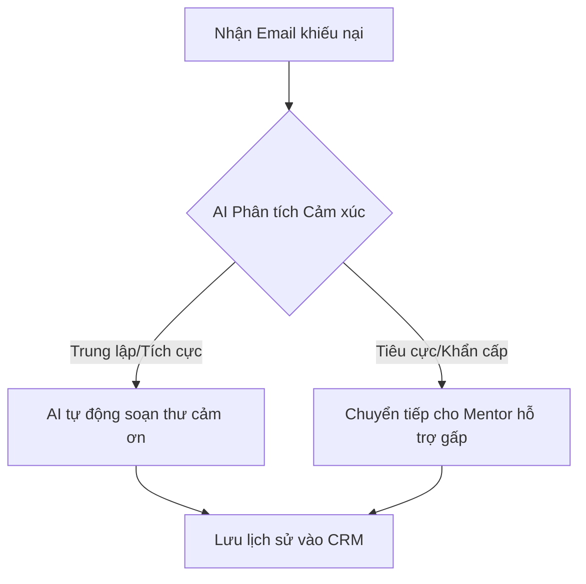

# Chương 01: Quy trình Agentic vs Luồng tuyến tính truyền thống

## 1. Deep Dive (Phân tích chuyên sâu)

### Sự sụp đổ của Luồng Tuyến Tính (Linear Pipelines)
Trong tự động hóa thông thường (như n8n cơ bản, Zapier, hoặc code Python tuần tự):
```
[Bước 1: Lấy Email] ──> [Bước 2: Dịch thuật bằng AI] ──> [Bước 3: Gửi Slack]
```
Mỗi bước chạy đúng 1 lần. Nếu ở Bước 2, kết quả dịch thuật bị lỗi cú pháp hoặc thiếu thông tin, hệ thống vẫn nhắm mắt gửi sang Bước 3, tạo ra sản phẩm lỗi cho người dùng cuối.

### Quy trình tự hành (Agentic Workflows)
Agentic Workflows đưa vào cơ chế **Vòng lặp (Loops)** và **Ra quyết định động (Decision Making)**. AI được cấp quyền tự kiểm tra chất lượng sản phẩm của mình, tự đánh giá xem kết quả đã đạt yêu cầu chưa, và tự quyết định bước tiếp theo:
```
                       ┌─────────────────────────┐
                       ▼                         │ (Nếu chưa đạt - Sửa lỗi)
[Yêu cầu] ──> [AI soạn thảo văn bản] ──> [AI tự kiểm tra chất lượng]
                                                 │
                                                 ▼ (Nếu đạt yêu cầu)
                                            [Xuất bản]
```
Nghiên cứu của Andrew Ng chỉ ra rằng: việc chuyển từ prompt một lượt (Zero-shot) sang quy trình Agentic giúp các mô hình nhỏ (như GPT-3.5) đạt hiệu suất vượt trội hơn cả các mô hình lớn chạy đơn lẻ.

---

## 2. Demo: Agent tự động kiểm tra và sửa lỗi Code Python

### Mục tiêu
Xây dựng một Agent thô sơ bằng Python, nhận yêu cầu viết code từ người dùng, chạy thử code đó, nếu phát hiện lỗi cú pháp, tự động gửi lại mã lỗi kèm code lỗi cho LLM để sửa, tối đa 3 lần.

### Mã nguồn (`self_correcting_agent.py`)
```python
import os
import sys
import io
from openai import OpenAI
from dotenv import load_dotenv

load_dotenv()
client = OpenAI(api_key=os.getenv("OPENAI_API_KEY"))

def generate_code(prompt: str, error_log: str = "") -> str:
    system_instruction = "Bạn là kỹ sư viết code Python. Hãy CHỈ trả về mã nguồn Python sạch, không có markdown, không chèn các ký tự ```python."
    
    user_content = prompt
    if error_log:
        user_content += f"\n\nMã nguồn trước đó bị lỗi sau:\n{error_log}\nHãy sửa lại code và trả về bản chạy tốt."

    response = client.chat.completions.create(
        model="gpt-4o-mini",
        messages=[
            {"role": "system", "content": system_instruction},
            {"role": "user", "content": user_content}
        ],
        temperature=0
    )
    return response.choices[0].message.content.strip()

def execute_and_test_code(code_str: str) -> str:
    # Thu giữ stdout và stderr của hệ thống để bắt lỗi chạy code
    old_stdout = sys.stdout
    old_stderr = sys.stderr
    redirected_output = sys.stdout = io.StringIO()
    redirected_error = sys.stderr = io.StringIO()
    
    try:
        # Thực thi chuỗi code Python
        exec(code_str, {})
        sys.stdout = old_stdout
        sys.stderr = old_stderr
        return "" # Không có lỗi
    except Exception as e:
        sys.stdout = old_stdout
        sys.stderr = old_stderr
        return f"{type(e).__name__}: {str(e)}"

def run_agent(task: str):
    print(f"Nhiệm vụ: {task}\n")
    code = generate_code(task)
    
    for attempt in range(3):
        print(f"--- Thử nghiệm lần {attempt + 1} ---")
        print(f"Mã nguồn sinh ra:\n{code}\n")
        
        error = execute_and_test_code(code)
        
        if not error:
            print("=> CODE CHẠY THÀNH CÔNG KHÔNG LỖI!")
            return code
        else:
            print(f"=> Lỗi phát hiện: {error}")
            print("Đang yêu cầu AI tự sửa...")
            code = generate_code(task, error)
            
    print("=> Agent thất bại sau 3 lần sửa.")
    return None

if __name__ == "__main__":
    # Cố tình đưa prompt dễ gây lỗi chia cho 0 hoặc lỗi logic
    bad_task = "Viết hàm chia 10 cho biến x, khai báo x = 0 ở đầu."
    run_agent(bad_task)
```

---

## 3. Mini Project

### Bài tập 1: Thiết kế sơ đồ kiến trúc luồng Agent phản hồi khách hàng (Mức độ: Trung bình)
* **Đề bài**: Hãy vẽ hoặc soạn thảo sơ đồ luồng hoạt động (Workflow Diagram) bằng định dạng Mermaid cho một AI Agent tiếp nhận và xử lý khiếu nại khách hàng. Quy trình cần thể hiện rõ bước kiểm tra điều kiện rẽ nhánh (Decision Making) của Agent dựa trên nội dung email của khách.
* **Tài liệu sườn mẫu (`agent_flow.md`)**:


### Bài tập 2: Thiết kế sơ đồ Agentic kiểm duyệt hóa đơn tự động (Mức độ: Khó)
* **Đề bài**: Thiết kế sơ đồ Mermaid mô phỏng quy trình xử lý của một AI Agent kiểm duyệt hóa đơn thanh toán. Agent cần thực hiện: Trích xuất thông tin hóa đơn -> Gọi API kiểm tra xem hóa đơn có bị trùng lặp ID không -> Nếu trùng lặp, chuyển trạng thái Cảnh báo; nếu không trùng lặp, tự động phê duyệt thanh toán.
* **Yêu cầu**: Bạn hãy tự hoàn thành không có tài liệu mẫu.
* **Gợi ý triển khai (Workflow Hints)**:
  - Sử dụng cú pháp sơ đồ Mermaid dạng `flowchart TD` hoặc `sequenceDiagram`.
  - Phân tách rõ các bước thực thi công cụ (Tool Execution) và các bước ra quyết định của mô hình LLM.
