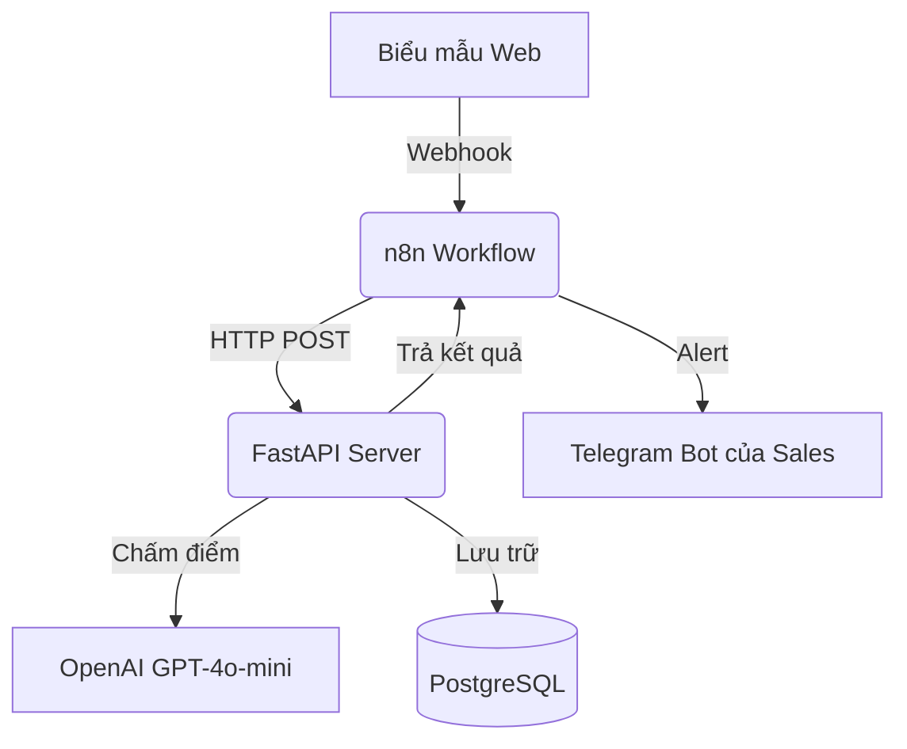

# Chương 02: Kỹ thuật viết file README dự án chuẩn B2B

## 1. Deep Dive (Phân tích chuyên sâu)

### Sự thất bại của các README kỹ thuật đơn thuần
Hầu hết lập trình viên chỉ viết README chứa đúng 2 dòng lệnh cài đặt thư viện. 
Khách hàng doanh nghiệp hoặc Project Manager khi click vào sẽ không thể hiểu dự án này có tác dụng gì và giải quyết bài toán gì của họ.

### Cấu trúc file README dự án chuẩn B2B chuyên nghiệp
Một file README dự án xuất sắc phải được cấu trúc để thuyết phục cả 2 nhóm độc giả: Lập trình viên kỹ thuật (cần biết cách cài đặt) và Quản lý doanh nghiệp (cần biết giá trị ROI sản phẩm).
Cấu trúc bắt buộc gồm:
1. **Title & Badges**: Tên dự án rõ ràng kèm theo các badges chỉ số chuyên nghiệp.
2. **Business Value (Giá trị doanh nghiệp)**: Giải thích ngắn gọn dự án này giúp tiết kiệm bao nhiêu tiền hoặc bao nhiêu giờ làm việc.
3. **Features (Tính năng)**: Danh sách các tính năng chính đạt được.
4. **Architecture (Kiến trúc)**: Sơ đồ khối Mermaid vẽ luồng chạy dữ liệu.
5. **Quick Start (Chạy nhanh)**: Hướng dẫn cài đặt và chạy thử trong 4 bước đơn giản.

---

## 2. Demo: Mẫu README dự án AI CRM hoàn chỉnh

### Mục tiêu
Cung cấp cấu trúc file README hoàn chỉnh cho dự án CRM Lead Qualification để bạn áp dụng trực tiếp cho repo dự án của mình.

### Nội dung mẫu (`PROJECT_README.md`)
```markdown
# AI CRM Lead Qualification Backend 🚀


Hệ thống backend tự động hóa quy trình tiếp nhận và thẩm định khách hàng tiềm năng (leads) sử dụng AI. Hệ thống giúp doanh nghiệp phân loại chính xác lead có budget lớn và thông báo tức thì cho phòng kinh doanh qua Telegram.

### 💰 Giá trị mang lại cho Doanh nghiệp
- **Cắt giảm 90% thời gian**: HR và Sales không cần đọc thủ công email của khách hàng để lọc thông tin.
- **Phản hồi tức thì**: Chấm điểm và phân loại lead trong vòng 3 giây kể từ khi khách điền biểu mẫu.
- **Tập trung nguồn lực**: Giúp Sales tập trung 100% thời gian chốt các khách hàng có ngân sách lớn (Qualified).

### 🛠️ Kiến trúc Hệ thống


### 🚀 Hướng dẫn Cài đặt nhanh
1. Sao chép dự án:
   ```bash
   git clone https://github.com/username/ai-crm.git
   cd ai-crm
   ```
2. Cấu hình biến môi trường trong file `.env`:
   ```env
   OPENAI_API_KEY=your_key
   SYSTEM_API_KEY=your_secret
   ```
3. Khởi chạy bằng Docker Compose:
   ```bash
   docker-compose up -d
   ```
4. Truy cập tài liệu API tại: `http://localhost:8000/docs`
```

---

## 3. Mini Project
Hãy áp dụng cấu trúc mẫu phía trên để soạn thảo một file README.md hoàn chỉnh và chuyên nghiệp cho **Project 03 (AI Chat PDF)** của bạn. Lưu file này vào thư mục của Project 03.
