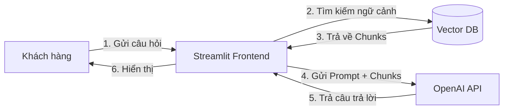
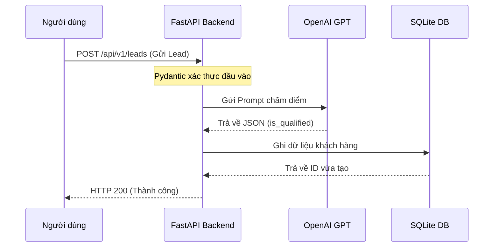

# Chương 03: Vẽ sơ đồ Kiến trúc Hệ thống bằng Mermaid.js

## 1. Deep Dive (Phân tích chuyên sâu)

### Tại sao sơ đồ kiến trúc lại quan trọng?
Một bức ảnh có giá trị bằng một vạn lời nói. Khi trình bày giải pháp AI Automation phức tạp cho khách hàng doanh nghiệp:
- Nếu bạn giải thích bằng miệng: *"Chúng tôi nhận webhook rồi gọi FastAPI rồi chạy OpenAI rồi ghi Postgres..."* -> Khách hàng sẽ bị rối và cảm thấy hệ thống không an toàn.
- Nếu bạn đưa ra một sơ đồ khối rõ ràng: Khách hàng sẽ nhìn thấy ngay đường đi của dữ liệu, cấu trúc bảo mật của hệ thống và cảm thấy vô cùng tin tưởng.

### Mermaid.js là gì?
Mermaid.js là một công cụ vẽ sơ đồ bằng mã nguồn (Diagrams-as-Code). Thay vì phải vẽ thủ công trên các công cụ như Photoshop hay PowerPoint rồi xuất file ảnh, bạn chỉ cần viết các câu lệnh text đơn giản. Trình duyệt web và GitHub sẽ tự động biên dịch đoạn text đó thành một sơ đồ trực quan tương tác.

---

## 2. Demo: Các mẫu Sơ đồ thông dụng trong AI Automation

### Mục tiêu
Cung cấp cú pháp mã nguồn Mermaid để vẽ sơ đồ dòng chạy dữ liệu (Flowchart) và sơ đồ tuần tự cuộc gọi API (Sequence Diagram).

### 1. Sơ đồ dòng chạy dữ liệu (Flowchart)
```markdown

```

### 2. Sơ đồ tuần tự cuộc gọi API (Sequence Diagram)
```markdown

```

---

## 3. Mini Project
Hãy mở công cụ vẽ sơ đồ online [mermaid.live](https://mermaid.live). Thiết kế một sơ đồ luồng hoạt động (Flowchart) của **Project 04 (AI Agent with MCP)** thể hiện rõ luồng giao tiếp giữa Client và MCP Server qua STDIO. Copy đoạn mã nguồn Mermaid đó chèn vào file báo cáo.
