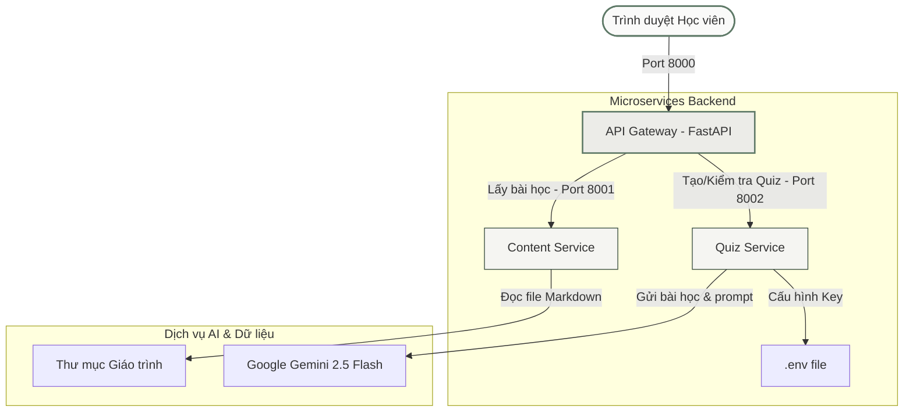

# 🎓 AI Automation Engineer Playbook & LMS Platform

<div align="center">

[](https://www.python.org/)
[](https://fastapi.tiangolo.com/)
[](https://deepmind.google/technologies/gemini/)
[](#)
[](#)

**Bộ giáo trình thực chiến đào tạo kỹ sư tự động hóa AI và Nền tảng học tập nội bộ chuẩn doanh nghiệp.**

🚀 **Trải nghiệm trực tuyến (GitHub Pages)**: [https://dieptuhuy.github.io/AI-Automation-Agency/](https://dieptuhuy.github.io/AI-Automation-Agency/)

[Tổng quan](#-tổng-quan) • [Tính năng nổi bật](#-tính-năng-nổi-bật) • [Cấu trúc giáo trình](#-cấu-trúc-giáo-trình) • [Kiến trúc hệ thống](#-kiến-trúc-hệ-thống) • [Hướng dẫn cài đặt](#-hướng-dẫn-cài-đặt) • [Giao diện học tập](#-giao-diện-học-tập)

</div>

---

## 📖 Tổng quan

**AI Automation Engineer Playbook** không phải là một khóa học lý thuyết đơn thuần. Đây là cẩm nang thực chiến chuyên sâu được thiết kế bởi hội đồng chuyên gia (Senior AI Engineer, AI Architect, Startup Founder) nhằm đào tạo học viên từ mức độ cơ bản trở thành một kỹ sư tự động hóa AI có năng lực triển khai hệ thống thực tế cho doanh nghiệp lớn và tự vận hành AI Automation Business.

Dự án đi kèm với **AI Playbook Platform** - Hệ thống Quản lý Học tập (LMS) nội bộ được phát triển trên kiến trúc **Microservices** hiện đại, tích hợp công cụ kiểm duyệt đề thi trắc nghiệm tự động hóa thông qua mô hình ngôn ngữ lớn **Gemini 2.5 Flash**.

---

## 🌟 Tính năng nổi bật

### 📘 Giáo trình thực chiến chuyên sâu
* **18 Volumes lý thuyết**: Đi từ nền tảng LLM, Prompt Engineering, Cấu trúc Dữ liệu, RAG, AI Agents đến các phần cao cấp như Model Context Protocol (MCP), DevOps và kỹ năng xây dựng Agency.
* **6 Dự án End-to-End**: Hệ thống mẫu hoàn chỉnh hỗ trợ xây dựng Portfolio bao gồm Customer Support Agent, Code Reviewer, Financial Analyst,...

### 💻 Nền tảng LMS chuẩn Doanh nghiệp
* **Kiến trúc Microservices**: Tách biệt hoàn toàn phần Quản lý Bài giảng (Content Service), Trắc nghiệm AI (Quiz Service) và Cổng kết nối (API Gateway).
* **Giao diện Soft-Paper thân thiện**: Thiết kế tông màu cát ấm (`#fafaf9`) kết hợp xanh xô thơm (`#5f7a68`) giúp giảm mỏi mắt, tăng độ tập trung khi đọc tài liệu dài.
* **Trắc nghiệm AI thông minh**: Tự động phân tích nội dung chương học, cho phép lựa chọn độ khó (Dễ/Trung bình/Khó) và số lượng câu hỏi (từ 3 đến 30 câu) để biên soạn đề bài thực hành thời gian thực.
* **Tìm kiếm & Đo lường tiến độ**: Tích hợp thanh tìm kiếm bài học tức thì cùng thanh đo tiến độ tự động ghi nhận qua LocalStorage.

---

## 📊 Cấu trúc giáo trình

Hệ thống bài học được phân chia thành các cấu phần khoa học:

| Volume | Tên Chương học / Kỹ năng | Công nghệ trọng tâm |
| :---: | :--- | :--- |
| **00** | Định hướng & Tư duy kỹ sư | Mindset & First Principles |
| **01-02** | Nền tảng LLM & Prompt Engineering | OpenAI, Anthropic, Gemini, JSON Mode |
| **03-04** | Python Automation & API Development | Requests, Asyncio, FastAPI, Pydantic |
| **05** | Tự động hóa quy trình với n8n | n8n Webhooks, Custom JS Nodes |
| **06-07** | Cơ sở dữ liệu & Vector Storage | PostgreSQL, ChromaDB, Pinecone |
| **08-09** | Kiến trúc RAG & AI Agents chuyên sâu | Chunking, Reranking, LangGraph, Tool Calling |
| **10** | Giao thức Model Context Protocol | MCP Server/Client Architecture |
| **11-12** | Triển khai & Vận hành Production | Docker, Nginx, SSL, Rate Limiting, Caching |
| **13-16** | Xây dựng Portfolio & Doanh nghiệp | Git Architecture, Sales Outreach, Proposal |
| **17** | 6 Dự án mẫu chuẩn Doanh nghiệp | End-to-End Enterprise Systems |

---

## 🛠️ Công nghệ sử dụng

### Backend Services
* **FastAPI (Python 3.10+)**: Xây dựng các cổng dịch vụ hiệu năng cao.
* **Httpx**: Kết nối bất đồng bộ giữa các node dịch vụ.
* **Google GenerativeAI SDK**: Tích hợp API của Gemini để xử lý logic câu hỏi.

### Frontend Web app
* **Vanilla HTML5 & CSS3**: Phát triển giao diện tùy biến tối đa, gọn nhẹ và tải cực nhanh.
* **Marked.js**: Biên dịch và hiển thị bài giảng Markdown thời gian thực.
* **Highlight.js**: Tô màu cú pháp các khối mã lập trình chuyên nghiệp.

---

## 🏗️ Kiến trúc hệ thống

Hệ thống được thiết kế theo mô hình Microservices phân tán giúp dễ dàng mở rộng và tối ưu hóa tài nguyên:



---

## 🚀 Hướng dẫn cài đặt

### Yêu cầu hệ thống
* Python 3.10 trở lên.
* Khóa API Google AI Studio (Gemini API Key).

### Các bước cài đặt chi tiết

1. **Tải mã nguồn dự án**:
   ```bash
   git clone https://github.com/DiepTuHuy/AI-Automation-Agency.git
   cd AI-Automation-Agency
   ```

2. **Cài đặt thư viện dependencies**:
   ```bash
   cd AI-Playbook-Platform
   pip3 install -r requirements.txt
   ```

3. **Cấu hình môi trường**:
   Sao chép tệp mẫu môi trường và điền thông tin thư mục giáo trình của bạn:
   ```bash
   cp .env.example .env
   ```
   *Lưu ý: API Key có thể cấu hình trực tiếp từ giao diện trang web sau khi chạy.*

4. **Khởi chạy hệ thống**:
   ```bash
   python3 run_all.py
   ```
   Sau khi dòng lệnh thông báo khởi chạy thành công, mở trình duyệt và truy cập: **[http://127.0.0.1:8000](http://127.0.0.1:8000)**.

---

## 🎨 Giao diện học tập

Giao diện học tập được tinh chỉnh tối đa cho nhu cầu nghiên cứu liên tục:
* **Khung đọc GitBook style**: Chiều rộng vùng đọc giới hạn ở `760px` giảm mỏi mắt.
* **Sidebar khoa học**: Dễ dàng đóng mở các Volume, tích hợp bộ tìm kiếm bài học nhanh.
* **Ngăn kéo Trắc nghiệm**: Trượt từ bên phải màn hình (`Quiz Drawer`), đi kèm hiệu ứng làm mờ nền để tối ưu hóa sự tập trung.

---

## 📄 Bản quyền & Đóng góp

* Dự án được phân phối dưới giấy phép **MIT License**.
* Mọi ý kiến đóng góp hoặc báo lỗi vui lòng mở mục **Issues** trên GitHub Repository.

---

<div align="center">
  <sub>Developed by Advanced AI Automation Team. Build with Passion.</sub>
</div>
